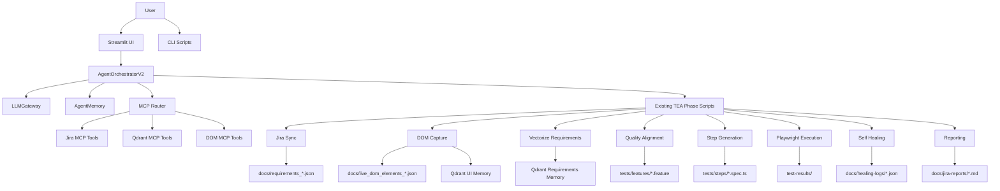

# TEA Architecture

This document describes the current architecture of the TEA (Test Execution Agent) framework as it exists in this repository today.

It covers:

- the legacy script-based execution model
- the current Streamlit-driven guided and auto-run modes
- the MCP router and tool layer
- memory, artifacts, and runtime configuration
- the current execution order used by the UI

## System Purpose

TEA converts Jira requirements into executable Playwright tests, runs them, analyzes failures, and reports results back to Jira.

The system currently supports two operating styles:

1. A script-first pipeline that executes each phase directly.
2. A newer agentic orchestration layer with Streamlit, runtime configuration, memory, and optional MCP tool usage.

## High-Level View



## Current Execution Modes

## 1. Legacy Script Flow

The original flow is still preserved and uses root-level scripts directly.

Current script order used in the repo:

```text
Jira Sync
  -> DOM Capture
  -> Vectorize Requirements
  -> Quality Alignment
  -> Step Generation
  -> Execution
  -> Self Healing
  -> Reporting
```

Scripts involved:

- `jira_sync_agent.py`
- `dom_capture.py`
- `vectorize_and_upload.py`
- `quality_alignment.py`
- `step_generator.py`
- Playwright execution
- `self_healing_agent.py`
- `report_to_jira.py`

## 2. Streamlit Guided Flow

The current UI in `ui/app.py` runs the same TEA phases, but wraps them in a reviewable flow.

Behavior:

- one step runs at a time
- the current step is highlighted in the UI flow tracker
- after each step, the UI shows the output
- the user can:
  - approve
  - edit, when the phase exposes an editable artifact
  - rerun the same step

If the user edits an artifact, that saved artifact becomes the input for the next step.

## 3. Streamlit Auto-Run Flow

The UI also supports a no-HITL mode.

Behavior:

- starts from the selected phase
- uses the same orchestrator
- auto-approves each checkpoint
- continues until the run is complete or fails

This is useful when the user wants the orchestration benefits without manual approvals.

## Current Guided Step Order

This is the step order currently used by the Streamlit app and orchestrator fallback path:

1. `jira_sync`
2. `dom_capture`
3. `vectorize`
4. `quality_alignment`
5. `step_generation`
6. `execution`
7. `self_healing`
8. `reporting`

This order is implemented in:

- `agents/agent_orchestrator_v2.py`
- `ui/app.py`

## Core Building Blocks

## 1. Existing TEA Phase Scripts

These remain the operational backbone of the system.

### `jira_sync_agent.py`

Responsibilities:

- fetch Jira issue data
- collect epic and related issue context
- download attachments
- parse supported attachment formats
- write consolidated requirements JSON

Primary outputs:

- `docs/requirements_<PROJECT>.json`
- `docs/inbox/requirements_<PROJECT>.json`
- `docs/inbox/attachments/*`

### `dom_capture.py`

Responsibilities:

- navigate to the application under test
- optionally authenticate
- capture interactive DOM state
- persist DOM snapshot
- write semantic UI memory into Qdrant

Primary outputs:

- `docs/live_dom_elements_<PROJECT>_<timestamp>.json`
- `docs/screenshots/*.png`
- Qdrant `<PROJECT>_ui_memory`

### `vectorize_and_upload.py`

Responsibilities:

- read requirements and attachment content
- generate embeddings
- upload requirement memory into Qdrant
- generate PRD content

Primary outputs:

- Qdrant `<PROJECT>_requirements`
- `docs/requirements/<PROJECT>_PRD.md`

### `quality_alignment.py`

Responsibilities:

- combine requirements, PRD, and DOM context
- generate Gherkin scenarios
- persist alignment report

Primary outputs:

- `tests/features/<PROJECT>.feature`
- `docs/quality_alignment_report_<PROJECT>.json`

### `step_generator.py`

Responsibilities:

- read feature files
- map steps into Playwright actions
- use Qdrant UI memory and `BasePage.ts`
- generate executable TypeScript test files

Primary outputs:

- `tests/steps/<PROJECT>.spec.ts`

### Playwright Execution

Responsibilities:

- execute generated Playwright tests
- collect raw results
- generate HTML report

Primary outputs:

- `test-results/`
- `playwright-report/`

### `self_healing_agent.py`

Responsibilities:

- inspect Playwright results
- classify drift and flaky failures
- optionally create bugs or execution metadata in external systems

Primary outputs:

- `docs/healing-logs/*.json`

### `report_to_jira.py`

Responsibilities:

- publish local execution summary
- attach evidence
- comment or update Jira

Primary outputs:

- `docs/jira-reports/*.md`

## 2. LLM Gateway

File:

- `llm_gateway.py`

Responsibilities:

- unify chat and embedding access across providers
- support provider switching via `.env`
- support tool-calling semantics
- provide fallback behavior for non-tool-capable models

Current providers supported:

- Ollama
- OpenAI
- Anthropic
- Gemini

## 3. Agentic Orchestrator

File:

- `agents/agent_orchestrator_v2.py`

Responsibilities:

- maintain run state
- ask the LLM for the next action
- execute approved phases
- optionally call MCP tools
- pause for human review in guided mode
- finalize and record the run

Key state model:

```python
STATE = {
    "completed": [],
    "last_output": None,
    "errors": [],
    "logs": [],
    "timeline": [],
    "pending_human": None,
    "current_phase": None,
    "status": "idle",
    "tool_results": [],
    "summary": {},
}
```

Supported planner actions:

- `run_phase`
- `call_tool`
- `ask_human`
- `stop`

## 4. MCP Layer

Files:

- `agents/mcp_router.py`
- `agents/mcp_tools/jira_tools.py`
- `agents/mcp_tools/qdrant_tools.py`
- `agents/mcp_tools/dom_tools.py`

Purpose:

- expose reusable, stateless operational tools
- separate tool behavior from orchestration logic
- provide a common call surface for the LLM and orchestrator

Router entry point:

```python
execute_tool(name: str, args: dict) -> dict
```

Available tools:

- `jira.create_bug`
- `jira.add_comment`
- `jira.get_issue`
- `qdrant.vector_search`
- `qdrant.vector_upsert`
- `dom.find_element`
- `dom.get_dom_snapshot`

### Important note on current MCP usage

The MCP layer is implemented and available, but in the current guided flow most work is still executed through `run_phase` decisions that call the original TEA scripts.

So today:

- MCP is part of the architecture
- MCP is usable
- but the dominant execution path is still the wrapped phase scripts

This is why the system should be understood as a hybrid architecture rather than a fully tool-native orchestration flow.

## 5. Memory Layer

File:

- `agents/agent_memory.py`

Purpose:

- store run history
- store planner decisions
- store failures and retry context
- provide recent context back to the orchestrator

Primary store:

- `docs/agent-memory/memory.json`

## 6. Streamlit UI

File:

- `ui/app.py`

Responsibilities:

- expose runtime configuration from `.env` defaults
- allow project selection and phase selection
- support guided mode and auto-run mode
- show step flow and current highlight
- render phase-specific output cards
- present action buttons below current output

Current UX model:

- single-column flow
- step tracker with arrows
- current output shown first
- action buttons directly below output:
  - `Approve`
  - `Edit`
  - `Rerun`

Sidebar responsibilities:

- project key
- start phase
- LLM provider selection
- model configuration
- app URL and credentials
- Jira configuration
- Qdrant configuration
- provider API keys

## Data and Artifact Flow

```mermaid
flowchart LR
    A["Jira issue + attachments"] --> B["jira_sync_agent.py"]
    B --> C["docs/requirements_<PROJECT>.json"]
    B --> D["docs/inbox/attachments/*"]

    C --> E["dom_capture.py"]
    E --> F["docs/live_dom_elements_<PROJECT>_<timestamp>.json"]
    E --> G["<PROJECT>_ui_memory in Qdrant"]

    C --> H["vectorize_and_upload.py"]
    D --> H
    F --> H
    H --> I["<PROJECT>_requirements in Qdrant"]
    H --> J["docs/requirements/<PROJECT>_PRD.md"]

    I --> K["quality_alignment.py"]
    G --> K
    J --> K
    K --> L["tests/features/<PROJECT>.feature"]

    L --> M["step_generator.py"]
    G --> M
    M --> N["tests/steps/<PROJECT>.spec.ts"]

    N --> O["Playwright"]
    O --> P["test-results/"]

    P --> Q["self_healing_agent.py"]
    Q --> R["docs/healing-logs/*.json"]

    R --> S["report_to_jira.py"]
    S --> T["docs/jira-reports/*.md"]
```



## Runtime Configuration Model

The runtime configuration comes from two places:

1. `.env`
2. Streamlit sidebar overrides

The sidebar uses `.env` values as defaults, then applies the chosen values to the current session.

Typical runtime knobs:

- project key
- start phase
- LLM provider
- app URL
- Jira URL
- Jira credentials
- Qdrant URL
- provider API keys

## Failure and Recovery Model

Guided mode:

- run one step
- inspect output
- user decides:
  - approve
  - edit
  - rerun

Auto mode:

- run one step
- auto-approve
- continue until end or failure

If a step fails:

- the failure is recorded in orchestrator state
- details are written to memory
- the UI exposes the latest failure output
- in guided mode the user can rerun the same step immediately

## Current Architectural Reality

The current system is best described as:

```text
A hybrid TEA architecture:
- legacy execution logic preserved in scripts
- agentic orchestration layered on top
- MCP tools available but not yet the dominant path
- Streamlit used as the operational control plane
```

That means the architecture is intentionally evolutionary:

- existing functionality is preserved
- orchestration, UI, and memory are added around it
- the system can continue moving toward deeper MCP-native behavior without breaking the current TEA pipeline

